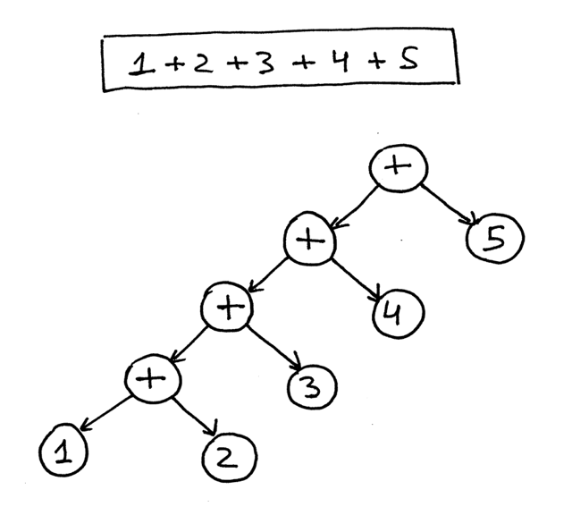

# Technical assignment sekoia

Made by HADJI KHALIL (aka H-ADJI)

## Objectif

Parallelised mathematical calculation using a home made Interpreter running on multiple python processes.

## High level architecture


## Project Setup

### Requirements

- Python version 3.x the version used for dev environment is 3.10.6
- add your python alias to the Makefile for ease of use 

```sh
py=python
```

or

```sh
py=python3
```

### Dependencies

- Make sure you're inside the project folder
- Create a virtual env to isolate dependencies from conflicting with other project using :

```sh
python -m venv venv
```

- Install dependencies using :

```sh
pip install -r requirements.txt
```

### Running the project

- **Run the server** :

```sh
make server
```

- **Run the client** :

```sh
make client
```

- **Run tests** :

```sh
make testing
```

## Implementation details

### Calculation interpreter

The component holding the logic for reading the arithmetic operations and computing the result. It is a basic implementation of an interpreter that uses the following pipeline :


- The arithmetic operations string is feed to the **parser** that **tokenize** the text into the defined symboles of the language (math operations in our case).
- The symboles are feed to a **parser** that generate an **AST** using the following logic :
  - operations with higher priority goes the base of the tree
  - operations with lower priority goes the root of the tree

<p align="center"></p>
  
- We use a Tree walk **evaluation strategy** to evaluate the math operation in the correct order :

<p align="center"></p>

### Client

- A simple process with a socket where data is sent to the client from the operations.txt file using a fixed size message.
- after sending all operations a special message is sent **EOO** = **End of Operations** so that the server stops the connection with client.
- Possible Optimization :
  - We could use a fixed size Header to optimize message length so that every operation sent to the server is preceded with a header that determines the operation length

### Calculation Server

This component is responsible for managing and running the calculation and it's composed of :

- The main process : a manager process that handles clients connection and delegates the calculations to worker process.
- the worker processes is the process running the calculation interpreter instance.
- The communication is done using :
  - Operations Pipes : This is a kind of Pipe where the main / manager process writes the operations using one pipe connection and the worker process consumes those operations
  - Results Pipes : This is the Pipe where the worker processes put the calculation results for the manager process to read
  - NB : Each worker process have it's own pair of operations pipe and result pipe because reading and writing to the same pipe connection can corrupt its data.

> **Python Official Documentation** :
> The two connection objects returned by Pipe() represent the two ends of the pipe. Each connection object has send() and recv() methods (among others). Note that data in a pipe may become corrupted if two processes (or threads) try to read from or write to the same end of the pipe at the same time. Of course there is no risk of corruption from processes using different ends of the pipe at the same time.

- The strategy used to distribute the load over the different process is **Round Robin**, where the manager process cyclicaly send operations to each worker process operation's pipe.
- Possible Optimization :
  - We could handle multiple connections by using a seprate thread to handle each connection, so that new connections do not block the manager process.
  - Use a more advanced scheduling algorithms that takes in consideraton process load metrics instead of using the simple **round robin** algorithm to distribute the load over processes.

- Finally the results that are read by the manager process from the pipes are logged into stdout and to a results.log file.
- Handling the client connection and the calculation output to stdout are done in different threads so that operations are logged as soon as a connection is made.

## Project Guidelines

- Develop a client which is able to send the information given at operations.7z:
  - send the information using sockets to the service,
  - receive information through the sockets and store the results in a file,

- Develop a service in Python which is built with the following features:
  - receive information using sockets,
  - It is built by 2 different processes (at least). Consider having more processes to speed calculations,
  - Processes must be able to exchange information using pipes. Please DO NOT use Threading or Pool,
  - Parent process must create and destroy child process for the arithmetic operations given at operations.7z,
  - Once the arithmetic operation is finished on the second process, such process should be destroyed by the parent process,
  - Consider that operations should not be calculated using eval(),
  - Consider using logging instead of console prints.
